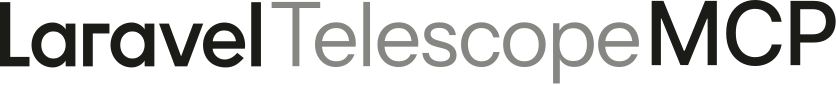

<p align="center"></p>

<p align="center">
  <a href="https://packagist.org/packages/lucianotonet/laravel-telescope-mcp"></a>
  <a href="https://packagist.org/packages/lucianotonet/laravel-telescope-mcp"></a>
  <a href="https://github.com/lucianotonet/laravel-telescope-mcp/actions/workflows/tests.yml"></a>
  <a href="LICENSE"></a>
</p>

An extension for Laravel Telescope that exposes telemetry data via the Model Context Protocol (MCP) to AI assistants (e.g., Cursor, Claude, Copilot Chat). Ideal for developers who use Telescope to inspect application metrics and require quick, precise insights.

## Overview

Telescope MCP exposes all Laravel Telescope telemetry data via the Model Context Protocol (MCP), enabling AI assistants to directly access and analyze application metrics. This provides developers with instant insights into logs, slow queries, HTTP requests, exceptions, jobs, and more through natural language queries.

## Requirements

- PHP 8.3+
- Laravel 11 or 12
- Laravel Telescope 5.0+

**Status**: ✅ **19 MCP tools fully operational and integrated**

### What's New in v1.0

🎉 **Now powered by the official [Laravel/MCP](https://github.com/laravel/mcp) package!**

- Built on Laravel's official MCP framework for better maintainability and long-term support
- Improved architecture with cleaner tool definitions using `Laravel\Mcp\Server\Tool`
- Enhanced schema validation with `JsonSchema` builder
- Better request handling with `Laravel\Mcp\Request` and `Laravel\Mcp\Response`
- Full backward compatibility maintained - all 19 tools work identically
- Ready for future Laravel/MCP features (Resources, Prompts, OAuth authentication)

## Quick Start
 
1. **Install the package:**
   ```bash
   composer require lucianotonet/laravel-telescope-mcp --dev
   ```
 
2. **Auto-configure your MCP client:**
   ```bash
   php artisan telescope-mcp:install
   ```
   > 💡 Automatically detects and configures: **Cursor**, **Claude Code**, **Windsurf**, **Cline**, **Gemini App**, **Antigravity**, **Codex**, and **OpenCode**.
 
3. **Restart your IDE/editor** and start using tools!
 
---
 
## Detailed Installation
 
### 1. Require Package
```bash
composer require lucianotonet/laravel-telescope-mcp --dev
```
 
### 2. Configure MCP Client
You can use the automatic installer or configure manually.
 
**Option A: Automatic Installation (Recommended)**
```bash
php artisan telescope-mcp:install
```
This command will:
- Detect installed MCP clients
- Generate the correct configuration file (`mcp.json`, `settings.json`, etc.)
- Set up the server in `stdio` mode
 
**Option B: Manual Configuration**
Add the following to your MCP client's configuration file:
 
```json
{
  "mcpServers": {
    "laravel-telescope": {
      "command": "php",
      "args": ["artisan", "telescope-mcp:server"],
      "cwd": "/path/to/your/project",
      "env": {
        "APP_ENV": "local"
      }
    }
  }
}
```
 
> [!IMPORTANT]
> **Antigravity users:** Antigravity does not support the `cwd` property. You must use the absolute path to `artisan` in the `args` array and it is recommended to add `"MCP_MODE": "stdio"` to the `env` object.
 
### 3. Verify Installation
Run the server manually to ensure it's working:
```bash
php artisan telescope-mcp:server
```
It should run silently (logging to stderr) and wait for JSON-RPC input.
 
---
 
## Manual Configuration per Assistant 

If you prefer to configure manually, add the following to your assistant's configuration file:

### Cursor, Windsurf, Cline
**File:** `mcp.json` or `cline_mcp_settings.json`
```json
{
  "mcpServers": {
    "laravel-telescope": {
      "command": "php",
      "args": ["artisan", "telescope-mcp:server"],
      "cwd": "/absolute/path/to/your/project",
      "env": {
        "APP_ENV": "local"
      }
    }
  }
}
```

### Claude Code (CLI)
You can configure via the `~/.claude/mcp.json` file (same format as Cursor) or via command:
```bash
claude mcp add -s local -t stdio laravel-telescope php artisan telescope-mcp:server
```

### Antigravity
**File:** `mcp_config.json` (Global configuration only)
```json
{
  "mcpServers": {
    "laravel-telescope": {
      "command": "php",
      "args": ["/absolute/path/to/your/project/artisan", "telescope-mcp:server"],
      "env": {
        "APP_ENV": "local",
        "MCP_MODE": "stdio"
      }
    }
  }
}
```

### OpenCode
OpenCode uses a different key and requires the absolute path to `artisan`.

**File:** `opencode.json`
```json
{
  "$schema": "https://opencode.ai/config.json",
  "mcp": {
    "laravel-telescope": {
      "type": "local",
      "enabled": true,
      "command": ["php", "/absolute/path/to/your/project/artisan", "telescope-mcp:server"],
      "environment": {
        "APP_ENV": "local"
      }
    }
  }
}
```

### Codex (TOML)
**File:** `config.toml`
```toml
[mcpServers.laravel-telescope]
command = "php"
args = ["artisan", "telescope-mcp:server"]
cwd = "/absolute/path/to/your/project"

[mcpServers.laravel-telescope.env]
APP_ENV = "local"
```

## Troubleshooting (Stdio)

### PHP or Artisan not found
Ensure `php` is in your global PATH or use the absolute path to the PHP executable. On Windows, use double backslashes `\\` in JSON/TOML paths.

### Permissions
Ensure the AI assistant has permission to read/write in your Laravel project's `storage` directory, where Telescope stores the data.

### MCP Logs
If tools don't appear, check your assistant's error logs (e.g., Cursor Output > MCP). The command `php artisan telescope-mcp:server` should run without errors if executed manually in the terminal.


## How to Use

Once connected, you can use the MCP tools directly in your AI assistant:

```bash
# List recent HTTP requests
@laravel-telescope-mcp requests --limit 5

# Details of a specific exception
@laravel-telescope-mcp exceptions --id 123456

# Find slow queries
@laravel-telescope-mcp queries --slow true --limit 10
```

## Usage Examples

### Direct MCP Tool Usage (Recommended)

Once connected, you can use the MCP tools directly in your AI assistant:

```bash
# List recent HTTP requests
@laravel-telescope-mcp requests --limit 5

# Get details of a specific exception
@laravel-telescope-mcp exceptions --id 123456

# Find slow database queries
@laravel-telescope-mcp queries --slow true --limit 10

# Check recent logs
@laravel-telescope-mcp logs --level error --limit 5
```

### Natural Language Queries

* *"Show me the last 5 error logs from the application"*
* *"Identify SQL queries taking longer than 100ms"*
* *"Display all failed jobs from the last hour"*
* *"Summarize HTTP requests with 5xx status codes"*

The AI will automatically use the appropriate MCP tools to fetch and analyze the data.

## Available Tools

All 19 MCP tools are fully operational and provide structured responses with both human-readable text and JSON data.

| Tool | Status | Description | Key Parameters |
| ---- | ------ | ----------- | -------------- |
| **Requests** | ✅ | Records incoming HTTP requests | `id`, `limit`, `method`, `status`, `path` |
| **Exceptions** | ✅ | Tracks application errors with stack traces | `id`, `limit` |
| **Queries** | ✅ | Monitors database queries with performance metrics | `id`, `limit`, `slow` (boolean) |
| **Logs** | ✅ | Records application logs with filtering | `id`, `limit`, `level`, `message` |
| **HTTP Client** | ✅ | Monitors outgoing HTTP requests | `id`, `limit`, `method`, `status`, `url` |
| **Mail** | ✅ | Monitors email operations | `id`, `limit`, `to`, `subject` |
| **Notifications** | ✅ | Records notification dispatches | `id`, `limit`, `channel`, `status` |
| **Jobs** | ✅ | Tracks queued job executions | `id`, `limit`, `status`, `queue` |
| **Events** | ✅ | Monitors event dispatches | `id`, `limit`, `name` |
| **Models** | ✅ | Tracks Eloquent model operations | `id`, `limit`, `action`, `model` |
| **Cache** | ✅ | Monitors cache operations | `id`, `limit`, `operation`, `key` |
| **Redis** | ✅ | Tracks Redis operations | `id`, `limit`, `command` |
| **Schedule** | ✅ | Monitors scheduled task executions | `id`, `limit` |
| **Views** | ✅ | Records view renders | `id`, `limit` |
| **Dumps** | ✅ | Records var_dump and dd() calls | `id`, `limit`, `file`, `line` |
| **Commands** | ✅ | Tracks Artisan command executions | `id`, `limit`, `command`, `status` |
| **Gates** | ✅ | Records authorization checks | `id`, `limit`, `ability`, `result` |
| **Batches** | ✅ | Lists and analyzes batch operations | `id`, `limit`, `status`, `name` |
| **Prune** | ✅ | Removes old Telescope entries | `hours` |

## Current Status & Features

### ✅ **MCP Integration Status**
- **19 MCP tools operational**: All major Telescope features are now accessible via MCP
- **Native Cursor integration**: Tools work directly within Cursor without external commands
- **Structured responses**: Each tool returns both human-readable text and JSON data
- **Real-time data access**: Direct access to Telescope telemetry without HTTP requests

### 🚀 **Key Benefits**
- **No more cURL needed**: Use MCP tools directly in your AI assistant
- **Instant insights**: Get application metrics through natural language
- **Structured data**: Both readable summaries and programmatic access
- **Full Telescope coverage**: Access to all major monitoring features

### 📊 **Response Format**
Each MCP tool provides:
- **Human-readable output**: Formatted tables and summaries
- **JSON data**: Structured data for programmatic processing
- **MCP compliance**: Standard MCP response format

### 🔧 **Tool Capabilities**
- **List operations**: Get overviews with customizable limits
- **Detail views**: Drill down into specific entries by ID
- **Filtering**: Apply filters like status, level, time ranges
- **Performance metrics**: Track slow queries, failed jobs, errors

## Configuration

* **Authentication**: Protect the MCP endpoint using middleware (e.g., `auth:sanctum`, `auth.basic`).
* **Endpoint Path**: Customize `TELESCOPE_MCP_PATH` or modify in `config/telescope-mcp.php`.
* **Logging**: Enable or disable internal MCP logging.
* **Timeouts & Limits**: Adjust request timeouts and payload limits as needed.

## Advanced

See `config/telescope-mcp.php` for:

* Custom middleware stacks
* Operation-specific settings
* Route and namespace overrides

## Performance & Monitoring

### **Real-time Insights**
- **HTTP Requests**: Monitor incoming traffic, response times, and status codes
- **Database Queries**: Track slow queries and optimize performance
- **Application Errors**: Get detailed stack traces and error context
- **Job Processing**: Monitor queue performance and failures
- **Cache Operations**: Track cache hit/miss ratios and performance

### **Data Retention**
- **Configurable limits**: Set appropriate limits for each tool based on your needs
- **Efficient queries**: Tools use optimized Telescope queries for fast responses
- **Memory management**: Responses are formatted efficiently for MCP clients

## Contributing

Contributions are welcome. Please submit issues or pull requests following our [CONTRIBUTING.md](/CONTRIBUTING.md) guidelines.

## License

Licensed under MIT. See [LICENSE](LICENSE) for details.
